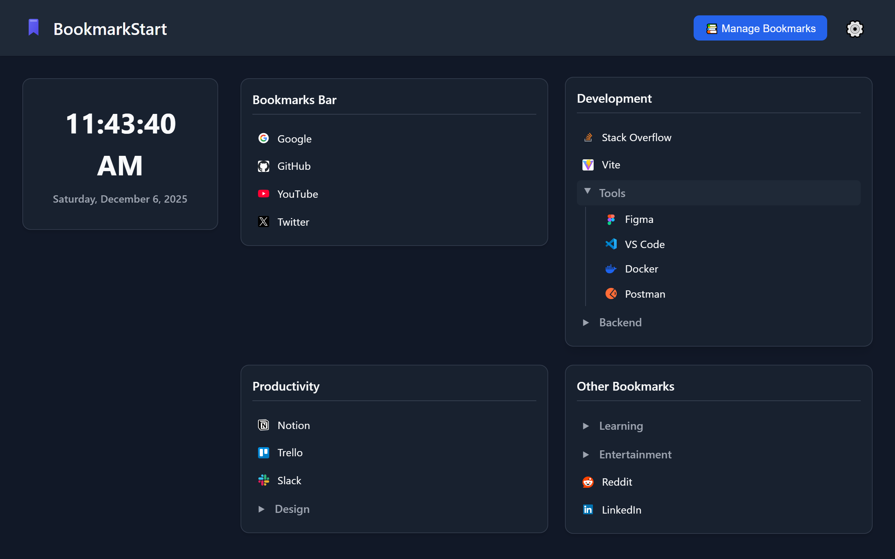

# BookmarkStart

Replace your new tab with organized bookmarks. Clean layout, dark mode, instant access. Simple and privacy-focused.## Demo




## Features

- **Organized Bookmark Layout**:
    - Top-level folders from the "Bookmarks Bar" are displayed as distinct groups.
- **Customizable**: 
    - Dark/Light mode
    - Compact mode
    - Alignment: Left/Right/Center

## Installation

### From Chrome Web Store
Coming soon.

### Install from source
1. Go to the [Releases](https://github.com/thiendaoxuan/BookmarkStart/releases) page.
2. Download the `bookmarkstart-vX.X.X.zip` file from the latest release.
3. Extract the downloaded zip file.
4. Open Chrome and go to `chrome://extensions/`, replace "chrome" with "edge", "brave", etc. depends on your browser.
5. Enable "Developer mode" in the top right corner.
6. Click "Load unpacked" and select the extracted folder.

## Development

```bash
npm install    # Install dependencies
npm run dev    # Start development server
npm run build  # Build for production
```

## Privacy

BookmarkStart does not collect or transmit any data. All bookmark information stays on your device.

---


