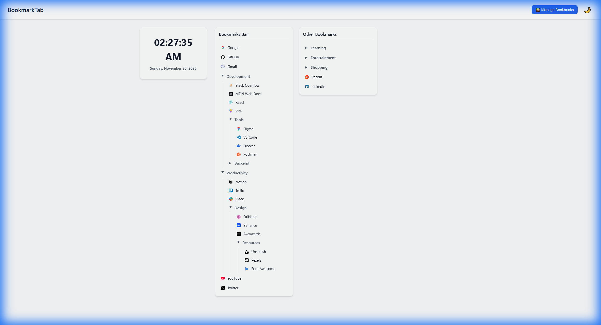

# BookmarkTab

A Chrome extension that replaces your new tab page with an organized bookmark manager.

## Demo



*Organize your bookmarks with nested folders, dark mode, and a clean interface*


## Features

- Grid layout for bookmark folders
- Dark mode support
- Live clock widget
- Clean, responsive design

## Installation

### From Chrome Web Store
Coming soon - extension is currently in review.

### Manual Installation
1. Clone this repository
2. Run `npm install`
3. Run `npm run build`
4. Open Chrome and go to `chrome://extensions/`
5. Enable "Developer mode"
6. Click "Load unpacked" and select the `dist` folder

## Development

```bash
npm install    # Install dependencies
npm run dev    # Start development server
npm run build  # Build for production
```

## Tech Stack

- React + Vite
- Chrome Extension APIs
- CSS Variables for theming

## Privacy

BookmarkTab does not collect or transmit any data. All bookmark information stays on your device.

## License

MIT

---


